# TP PROGRAMMATION SYSTEME
#### CHERIFI Sacha
#### IDBAHA Maroua

This project implements a minimal Unix shell named **enseash**, developed incrementally through several questions.
Each step introduces core system programming concepts such as low-level I/O , process creation, and process termination handling.

## Question 1 — Welcome Message and Prompt Display

### Objective:

At startup, the shell must:
- display a welcome message,
- indicate how to exit the shell,
- then show a prompt inviting the user to enter commands.

### Implementation Principle:

This question focuses on **basic output handling** using low-level system calls.

- Output is written directly to **STDOUT** using `write()`.
- No higher-level I/O functions such as printf are used.
- No user input is processed at this stage.

### Output


## Question 2 — Reading and Executing Simple Commands

### Q2a — Reading User Input

The shell waits for user input using the system call :

```c
read(STDIN_FILENO, buffer, size);
```

**Key points:**
- Input is read from standard input (`STDIN`) using the `read()` system call.
- The number of bytes read is stored and checked to detect special cases (e.g. EOF).
- The newline character (`\n`) generated by pressing Enter is removed.
- The input buffer is converted into a valid C string by appending the null terminator (`\0`).
- Only simple commands without arguments are handled at this stage.

###  Q2b — Executing a Command

To execute a command, the shell relies on **process creation and execution** mechanisms provided by Unix systems.

The execution workflow is the following:

- `fork()` is used to create a **child process**
- The child process replaces its code using `execlp()` to execute the requested command
- The parent process waits for the child to terminate using `wait()`

This separation ensures that:
- the shell itself continues running,
- the executed command runs independently in the child process.

### Q2c — Command Loop

The shell execution logic is implemented inside an infinite loop (`while(1)`) :

- The prompt is displayed at the beginning of each iteration
- User input is read and processed at each loop iteration
- Each command is executed independently in a child process
- After command execution, the shell returns to the prompt and waits for new input

This allows the shell to continuously process commands until it is explicitly terminated.

### Summary

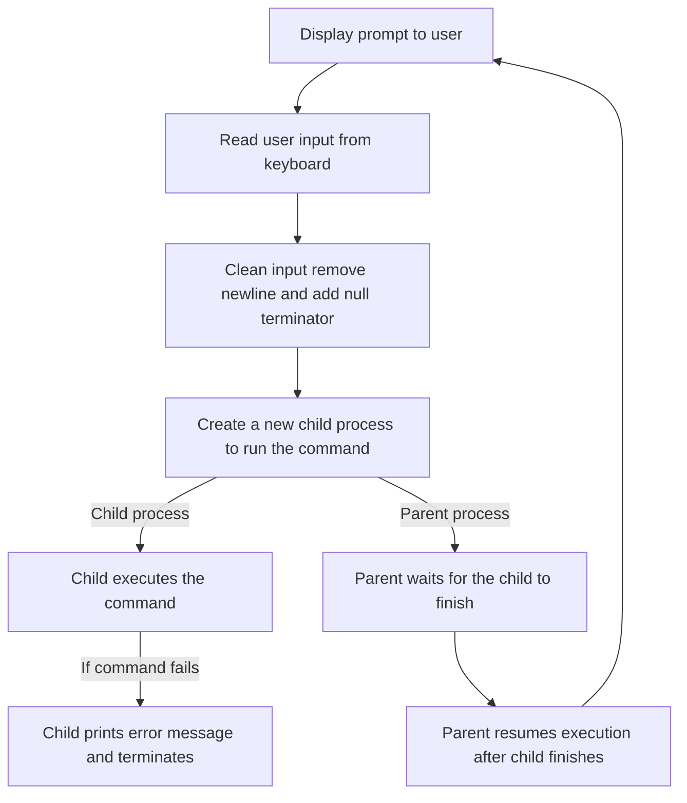

### Output


## Question 3 — Handling exit and Ctrl+D

### Objective:
The shell must terminate cleanly in two cases:
- When the user enters the `exit` command.
- When `read()` returns `0`, indicating an end-of-file (Ctrl+D).

In both cases, the shell exits after displaying a termination message.

### Summary

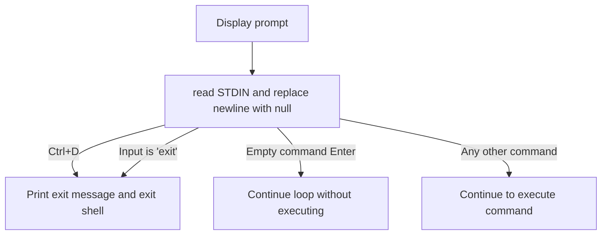
### Output

*Exit using the exit command :*


This corresponds to a voluntary and explicit termination of the shell.

*Exit using Ctrl + D (EOF) :*


- Ctrl + D sends an EOF (End Of File) on standard input
- The shell detects that no more input is available
- It exits and prints Bye bye...
  
This corresponds to an implicit termination of the shell due to end-of-input.

Both these conditions allow the shell to be closed in a controlled and predictable manner.

## Question 4 — Displaying the Command Termination Status
#### Objective:

After executing a command, the shell updates its prompt to indicate the termination status of the previously executed command.

#### Termination Analysis :

When a command finishes, the parent process retrieves its termination status using the system call:
```c
wait(&status);
```

Two termination cases exist in Unix systems :

1-  *Normal termination* (the command exits using return or exit()) :

Every command returns an exit code when it finishes:
- Exit code 0 means that the command executed successfully.
- Exit code different from 0 means that an error occurred during execution.

For example:

- The command `true` always succeeds and therefore returns exit code 0.
- The command `false` always fails and therefore returns exit code 1.
- If a command does not exist or cannot be executed, it also returns a non-zero exit code.

In the shell, this exit code is displayed in the prompt:
```text
enseash [exit:N] %
```
Where `N` corresponds to the exit code returned by the previously executed command.


This behavior allows the shell to indicate whether the last command succeeded or failed.

2- *Termination by signal* :  the shell detects and reports a command that terminates abnormally, i.e. interrupted by a signal (e.g. segmentation fault, kill).

To test this behavior, a dedicated program `test_signal_-q4` is executed from the shell.

This program:

- retrieves its own process identifier using `getpid()`,
- enters an infinite loop,
- periodically prints its PID to indicate that it is running,
- can only be stopped by receiving an external signal.

As long as no signal is sent, the program runs normally.

Two terminals are used:


1. **First terminal**

The program `test_signal_q4` is launched from `enseash`.  
The shell displays that the process is running and prints its PID repeatedly.

2. **Second terminal**

The process is terminated manually using the command:

```bash
kill -9 <pid>
```
where `<pid>` corresponds to the PID printed by the running program.

After receiving the signal:

- the running program stops immediately,
- control returns to the shell,
- the prompt is updated to indicate signal-based termination

The shell displays:

```text
enseash [sign:9] %
```
This confirms that : 
- the process did not terminate normally,
- it was interrupted by signal number 9 (`SIGKILL`).

#### Summary

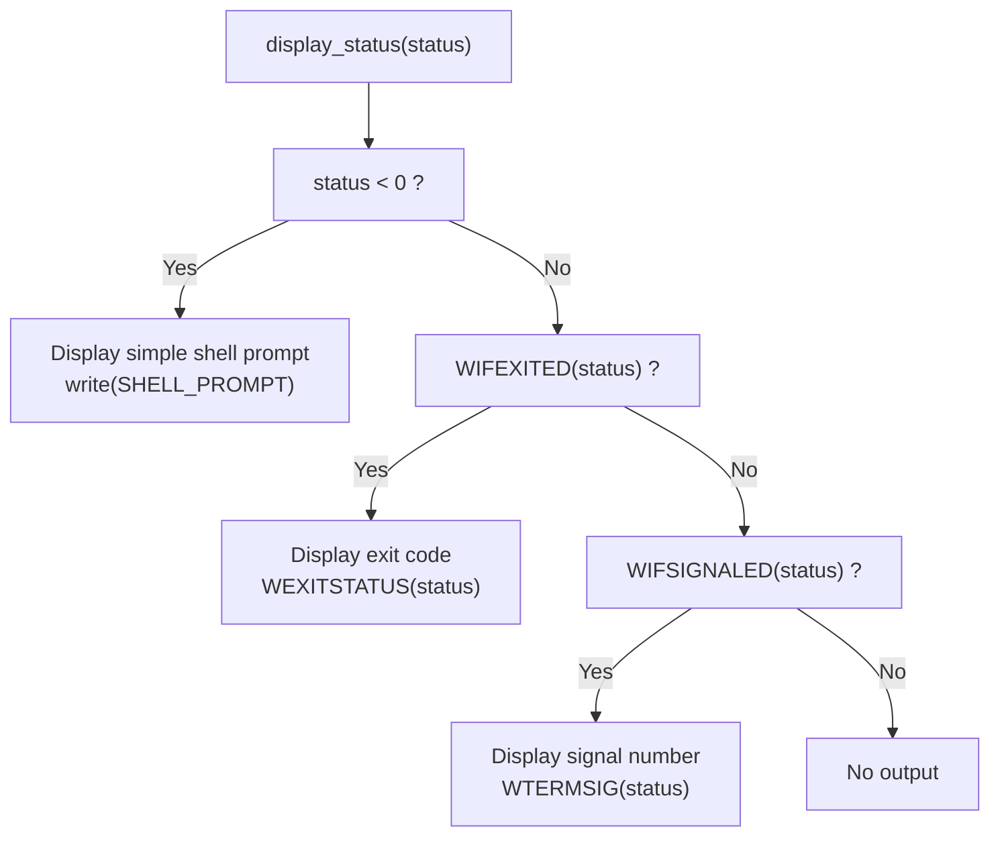

## Question 5 - Measuring Command Execution Time

###  Objective

The goal of this question is to measure the **execution time of each command** and display it directly in the shell prompt.

The prompt format is extended to include the execution duration in milliseconds:

```text
enseash [exit:N|Tms] %
enseash [sign:S|Tms] %
```

Where :

- N is the exit code returned by the command,
- S is the signal number if the command was terminated by a signal,
- T represents the execution time in milliseconds.

###  Implementation Principle

To measure the execution time, the shell uses the system call:

```c
clock_gettime(CLOCK_MONOTONIC, &ts);
```
Two timestamps are recorded:

- one just before launching the command,
- one just after the command terminates.

The difference between these two timestamps gives the execution duration of the command.

The clock `CLOCK_MONOTONIC` is used to ensure that the measured time is not affected by system clock changes.

### Output
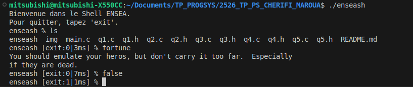

After executing a command, the shell displays both:
- the termination status (exit code or signal).
- the execution time.

##  Question 6 — Executing a Complex Command (with Arguments)

###  Objective
Until now, the shell could only execute **simple commands without arguments** (e.g. `ls`, `date`).  
In this question, the shell is extended to support **commands with arguments**.
This requires two steps:
1. Split the user input into a command + its arguments.
2. Execute the command using `execvp()`, which supports an argument array.

###  Implementation Principle

To run a command such as:
```text
fortune -s osfortune
```
The shell must convert the string into an array like:

```c
args[0] = "fortune";
args[1] = "-s";
args[2] = "osfortune";
args[3] = NULL;
```
This array format is mandatory because `execvp()` expects:
- `args[0]` = program name
- `args = NULL` terminated array of arguments

To achieve this, the function:
```c
void find_arguments(char *command, char **args);
```
splits the string using spaces as separators, and stores each token into `args`.

To prevent buffer overflow, the maximum number of tokens stored is limited by:
```c
#define ARGS_MAXSIZE 1024
```
Once the argument array is ready, execution is done using:

- `fork()` to create a child process
- `execvp()` to run the command with its arguments
- `wait()` so the parent (the shell) waits for the child and retrieves its status

*Prototype:*

```c
void execute_complex_command(char **command, int *status);
```

`execvp(args[0], args)` searches the program in the system PATH (like a real shell).

If execution fails, the child prints an error using perror("enseash") and exits with code 1.

### Output
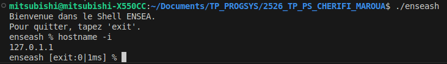

The command `hostname -i` demonstrates the execution of a complex command with arguments.

The output `127.0.1.1` corresponds to the loopback IP address of the local machine, which is the expected result for the command `hostname -i`.

The prompt is  updated with the return code (`exit:0`) and the execution time.

The shell can now execute commands with arguments, while still displaying:
- the exit code or signal (Question 4)
- the execution time (Question 5)
  
### Summary

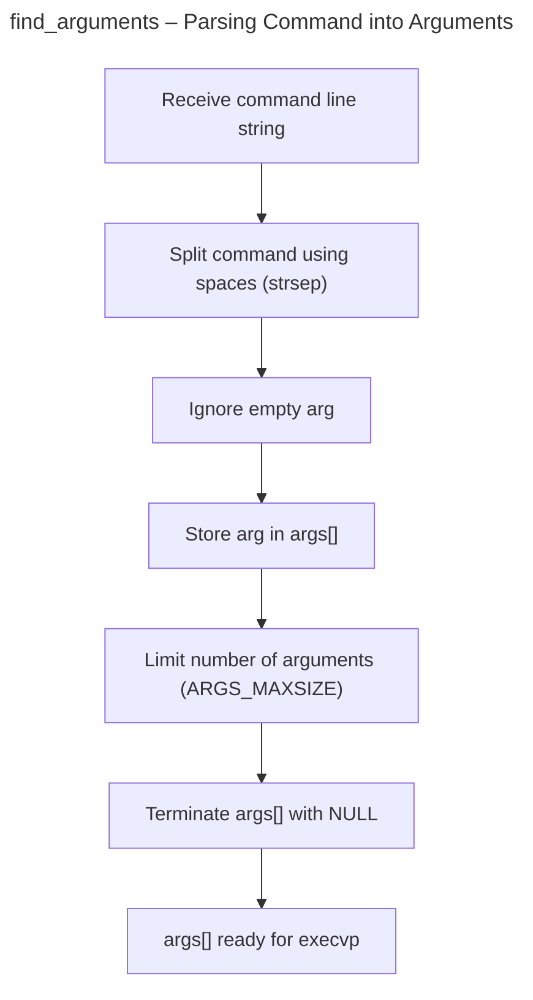

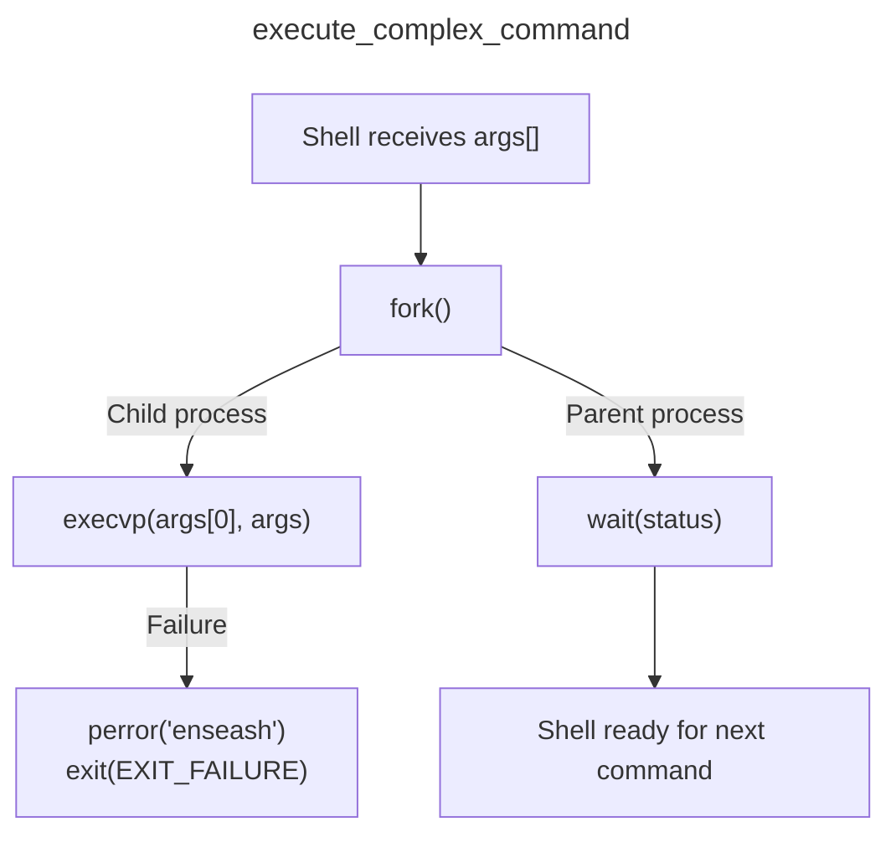

## Question 7 - I/O Redirections 

###  Objective

Add support for basic redirections in the shell:
- `>` redirect stdout (command output) to a file
- `<` redirect stdin (command input) from a file

###  Principle

A Unix program normally communicates using standard file descriptors:
- `STDIN_FILENO` → input (keyboard)
- `STDOUT_FILENO` → output (terminal)
  
Redirection means: **replace STDIN or STDOUT by a file descriptor obtained with** `open()`, using:
- `dup2(fd, STDIN_FILENO)` for `<`
- `dup2(fd, STDOUT_FILENO)` for `>`

The redirection must be applied inside the child process (after `fork()` and before `execvp()`) so that the shell itself is not affected.

###  Implementation Steps

*1. **Detect the redirection symbol***

The function `find_redirection()` is systematically called in main before executing a command.

Its role is to determine whether the entered command includes an input or output redirection.

It scans the argument array `args[]` to detect the presence of a redirection symbol:

- if `<` is found → input redirection `REDIR_IN`
- if `>` is found → output redirection `REDIR_OUT`
- otherwise → no redirection `REDIR_NONE`
  
In addition to identifying the redirection type, the function stores the position of the symbol in the argument array.
This position is later used to apply the redirection and clean the argument list before execution.

*2. **Apply the redirection in the child process***

The function `apply_redirection()`:

 **opens the file depending on the redirection type:**

- `<` → `open(file, O_RDONLY)`
- `>` → `open(file, O_WRONLY | O_CREAT | O_TRUNC, 0644)`

**replaces STDIN or STDOUT using `dup2()`:**

- `<` → `dup2(fd, STDIN_FILENO)`
- `>` → `dup2(fd, STDOUT_FILENO)`

**closes the file descriptor and removes the redirection tokens from the argument list:**
```c
args[position] = NULL;
```
This prevents `execvp()` from receiving `<` or `>` as normal command arguments.

*3. **Execute the command normally***

The function `execute_complex_command_redir()`:
- creates a child process with `fork()`
- the child applies redirection and executes the command with `execvp()`
- the parent waits for termination using `wait()`

### Output

With this implementation:

  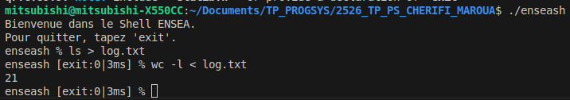
  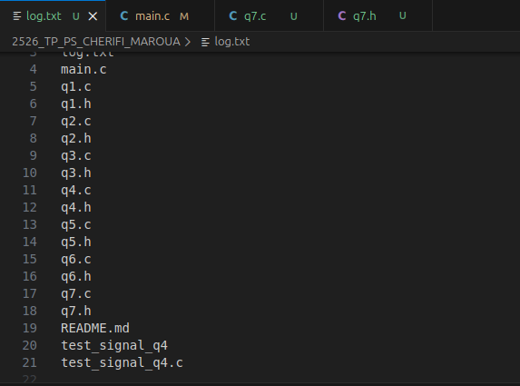
  
- The command `ls > log.txt` redirects the output of `ls` into the file instead of the terminal.
- The command `wc -l < log.txt` reads the file as standard input instead of waiting for keyboard input  and counts the number of lines.
The output 21 indicates that the directory contains 21 files.
  
This reproduces the standard shell behaviour for basic I/O redirections.

### Summary

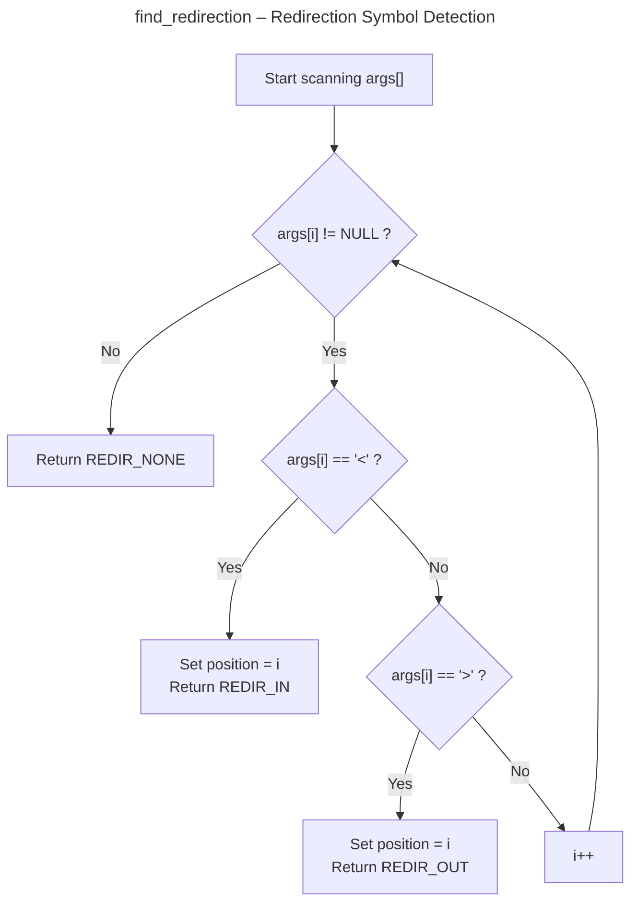

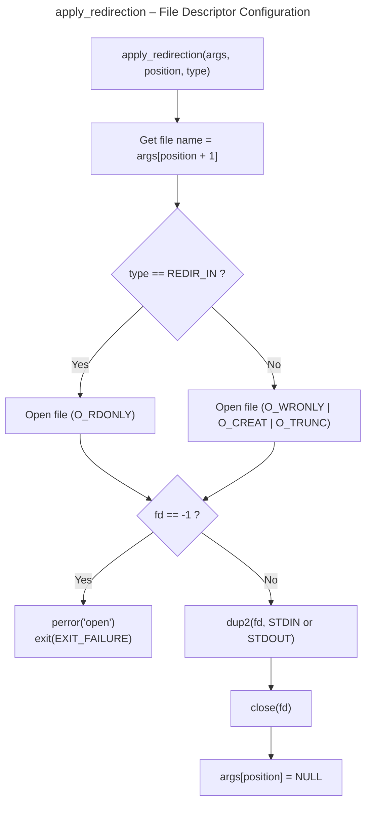

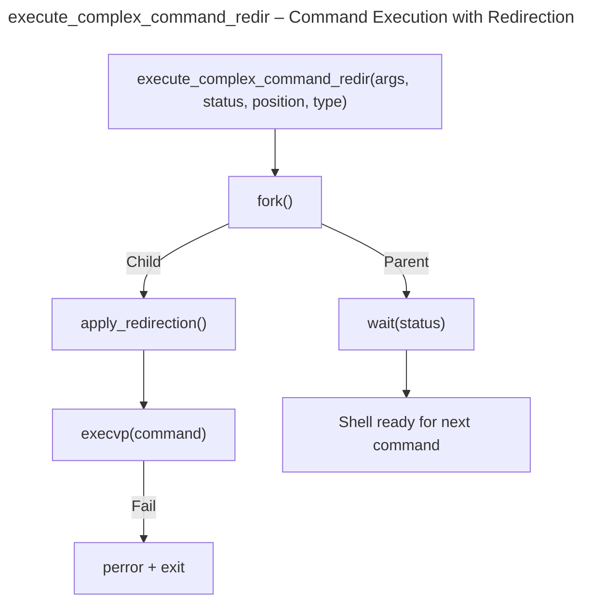

## Question 8 — Pipe redirection (`|`)

### Objective
This question implements the **pipe operator** `|`.

A pipe connects **two commands** so that:
- the **output (stdout)** of the left command becomes the **input (stdin)** of the right command.

### Implementation principle
A pipe is created with:
```c
pipe(fds);
```
It returns two file descriptors:
- `fds[0]` → **read end** of the pipe
- `fds[1]` → `**write end** of the pipe
Then the shell creates two child processes:

*1. **Child 1 (left command)*** redirects its `STDOUT` to the pipe write end → `dup2(fd_write, STDOUT_FILENO)`

*2. **Child 2 (right command)*** redirects its `STDIN` to the pipe read end → `dup2(fd_read, STDIN_FILENO)`

Finally:
- the parent closes both ends of the pipe
- waits for both children with `waitpid()

#### Detect the pipe symbol

The function `find_redirection_and_pipe()` scans `args[]` to locate:
- `<` → `REDIR_IN`
- `>` → `REDIR_OUT`
- `|` → `PIPE`
- otherwise → `REDIR_NONE`
It also stores the symbol position in `position`.

#### Split the command into two parts

Once the pipe symbol `|` is found, the command line is split into two separate argument lists.

```c
args[position] = NULL;
char **args2 = &args[position + 1];
```

This operation creates two independent argument arrays:
- `args` → left command (before `|`)
- `args2` → right command (after `|`)
  
The `|` symbol itself is removed so it is not passed to `execvp()`.

####  Execute both commands with `pipe + fork + dup2`

The function `execute_complex_command_pipe()` performs the following steps:

#### Create pipe

```c
pipe(fds);
```

This creates a unidirectional communication channel:
- `fds[0]` → read end
- `fds[1]` → write end

---

#### Fork child 1 (left command)

The first child executes the command located **before** the pipe symbol `|`.

*Actions performed:*
- redirect `stdout` to the pipe write end
- close unused file descriptors
- execute the command with `execvp`

*Conceptual code:*

```c
dup2(fd_write, STDOUT_FILENO);
execvp(args[0], args);
```
---

#### Fork child 2 (right command)

The second child executes the command located **after** the pipe symbol `|`.

*Actions performed:*
- redirect `stdin` to the pipe read end
- close unused file descriptors
- execute the command with `execvp`

*Conceptual code:*
```c
dup2(fd_read, STDIN_FILENO);
execvp(args2[0], args2);
```
---

####  Parent process

The parent process:
- closes both ends of the pipe (important to avoid blocking)
- waits for both child processes to finish

```c
waitpid(pid1, status, 0);
waitpid(pid2, status, 0);
```

This ensures that the pipeline execution is completed before returning to the shell prompt.

### Output

The command `ls | sort` demonstrates the pipe mechanism.


The output of `ls` is redirected to the input of `sort`, resulting in an alphabetically sorted list of files.

The correct output confirms that the pipe redirection is correctly implemented.

### Summary
*(**find_redirection_and_pipe**) we only add strcmp for "|" to (**find_redirection**) of question 7.*

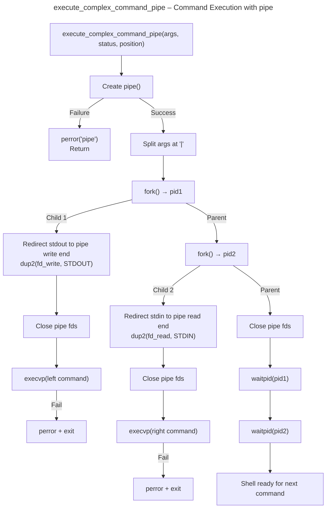


