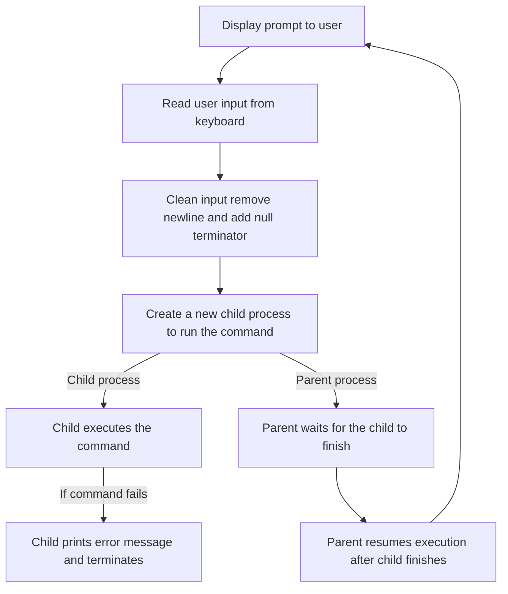
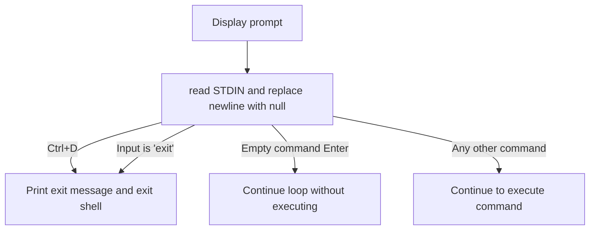
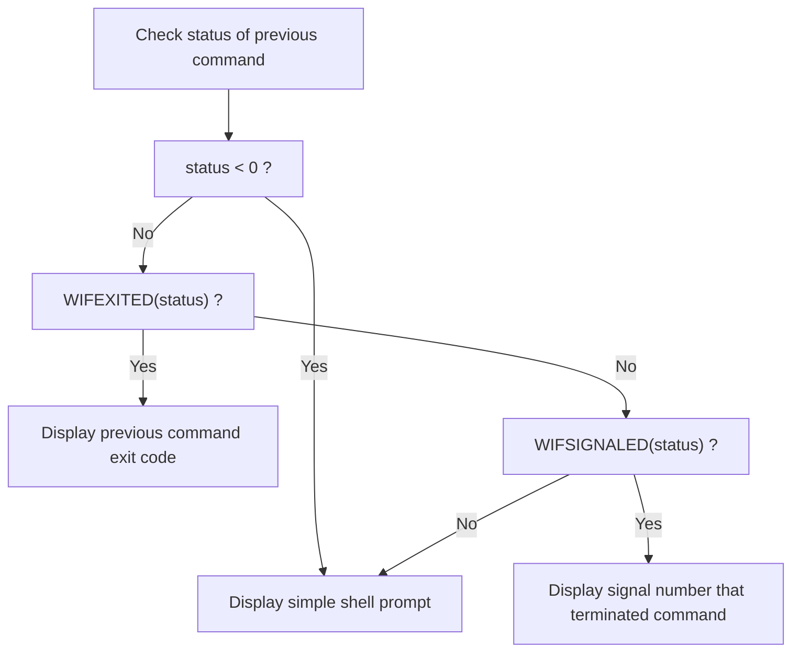

# TP PROGRAMMATION SYSTEME
#### CHERIFI Sacha
#### IDBAHA Maroua

This project implements a minimal Unix shell named **enseash**, developed incrementally through several questions.
Each step introduces core system programming concepts such as low-level I/O , process creation, and process termination handling.

## Question 1 — Welcome Message and Prompt Display

#### Objective:

At startup, the shell must:
- display a welcome message,
- indicate how to exit the shell,
- then show a prompt inviting the user to enter commands.

#### Implementation Principle:

This question focuses on **basic output handling** using low-level system calls.

- Output is written directly to **STDOUT** using `write()`.
- No higher-level I/O functions such as printf are used.
- No user input is processed at this stage.

#### Output


## Question 2 — Reading and Executing Simple Commands

#### Q2a — Reading User Input

The shell waits for user input using the system call :

```c
read(STDIN_FILENO, buffer, size);
```

**Key points:**
- Input is read from standard input (`STDIN`) using the `read()` system call.
- The number of bytes read is stored and checked to detect special cases (e.g. EOF).
- The newline character (`\n`) generated by pressing Enter is removed.
- The input buffer is converted into a valid C string by appending the null terminator (`\0`).
- Only simple commands without arguments are handled at this stage.

####  Q2b — Executing a Command

To execute a command, the shell relies on **process creation and execution** mechanisms provided by Unix systems.

The execution workflow is the following:

- `fork()` is used to create a **child process**
- The child process replaces its code using `execlp()` to execute the requested command
- The parent process waits for the child to terminate using `wait()`

This separation ensures that:
- the shell itself continues running,
- the executed command runs independently in the child process.

#### Q2c — Command Loop

The shell execution logic is implemented inside an infinite loop (`while(1)`) :

- The prompt is displayed at the beginning of each iteration
- User input is read and processed at each loop iteration
- Each command is executed independently in a child process
- After command execution, the shell returns to the prompt and waits for new input

This allows the shell to continuously process commands until it is explicitly terminated.

#### Summary



#### Output


#### Question 3 — Handling exit and Ctrl+D

#### Objective:
The shell must terminate cleanly in two cases:
- When the user enters the `exit` command.
- When `read()` returns `0`, indicating an end-of-file (Ctrl+D).

In both cases, the shell exits after displaying a termination message.

These conditions allow the shell to be closed in a controlled and predictable manner.

#### Summary


#### Output


## Question 4 — Displaying the Command Termination Status
#### Objective:

After executing a command, the shell updates its prompt to indicate the termination status of the previously executed command.

#### Termination Analysis :

When a command finishes, the parent process retrieves its termination status using the system call:
```c
wait(&status);
```

Two termination cases exist in Unix systems :

1-  *Normal termination* (the command exits using return or exit()) :

Every command returns an exit code when it finishes:
- Exit code 0 means that the command executed successfully.
- Exit code different from 0 means that an error occurred during execution.

For example:

- The command `true` always succeeds and therefore returns exit code 0.
- The command `false` always fails and therefore returns exit code 1.
- If a command does not exist or cannot be executed, it also returns a non-zero exit code.

In the shell, this exit code is displayed in the prompt:
```text
enseash [exit:N] %
```
Where `N` corresponds to the exit code returned by the previously executed command.


This behavior allows the shell to indicate whether the last command succeeded or failed.

2- *Termination by signal* :  the shell detects and reports a command that terminates abnormally, i.e. interrupted by a signal (e.g. segmentation fault, kill).

To test this behavior, a dedicated program `test_signal_-q4` is executed from the shell.

This program:

- retrieves its own process identifier using `getpid()`,
- enters an infinite loop,
- periodically prints its PID to indicate that it is running,
- can only be stopped by receiving an external signal.

As long as no signal is sent, the program runs normally.

Two terminals are used:


1. **First terminal**

The program `test_signal_q4` is launched from `enseash`.  
The shell displays that the process is running and prints its PID repeatedly.

2. **Second terminal**

The process is terminated manually using the command:

```bash
kill -9 <pid>
```
where `<pid>` corresponds to the PID printed by the running program.

After receiving the signal:

- the running program stops immediately,
- control returns to the shell,
- the prompt is updated to indicate signal-based termination

The shell displays:

```text
enseash [sign:9] %
```
This confirms that : 
- the process did not terminate normally,
- it was interrupted by signal number 9 (`SIGKILL`).

#### Summary



## Question 5 - 

###  Objective

The goal of this question is to measure the **execution time of each command** and display it directly in the shell prompt.

The prompt format is extended to include the execution duration in milliseconds:

```text
enseash [exit:N|Tms] %
enseash [sign:S|Tms] %
```

Where :

- N is the exit code returned by the command,
- S is the signal number if the command was terminated by a signal,
- T represents the execution time in milliseconds.

###  Implementation Principle

To measure the execution time, the shell uses the system call:

```c
clock_gettime(CLOCK_MONOTONIC, &ts);
```
Two timestamps are recorded:

- one just before launching the command,
- one just after the command terminates.

The difference between these two timestamps gives the execution duration of the command.

The clock `CLOCK_MONOTONIC` is used to ensure that the measured time is not affected by system clock changes.

###  Observed Behavior

After executing a command, the shell displays both:
- the termination status (exit code or signal).
- the execution time.


## Question 6 - 


## Question 7 - 


